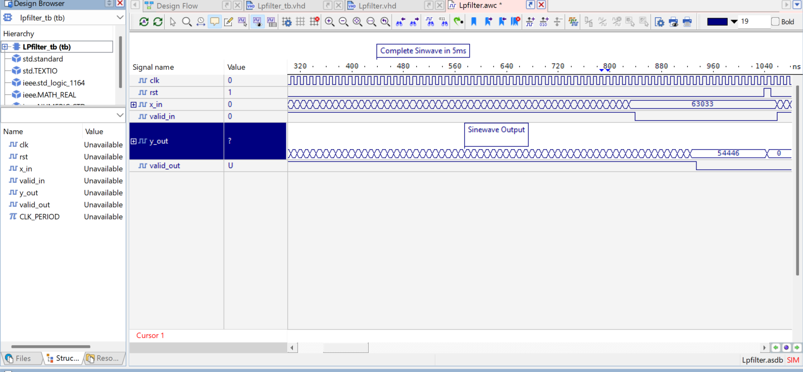
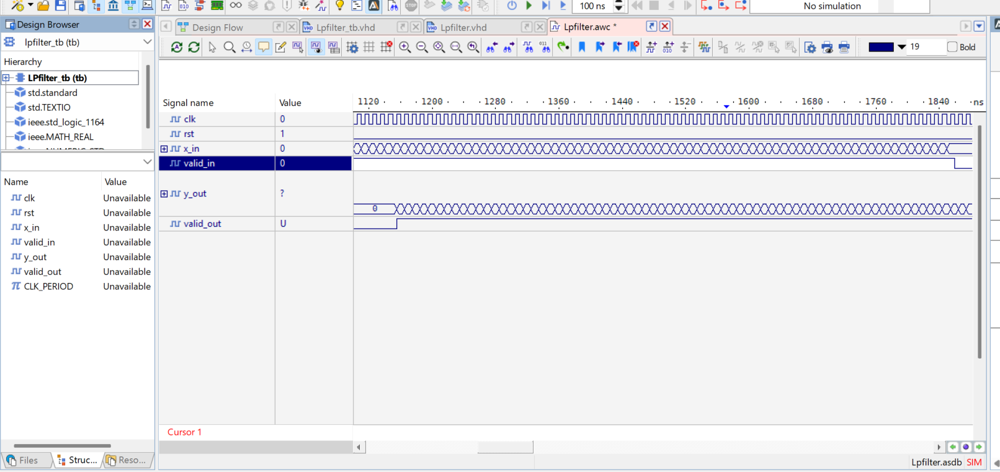
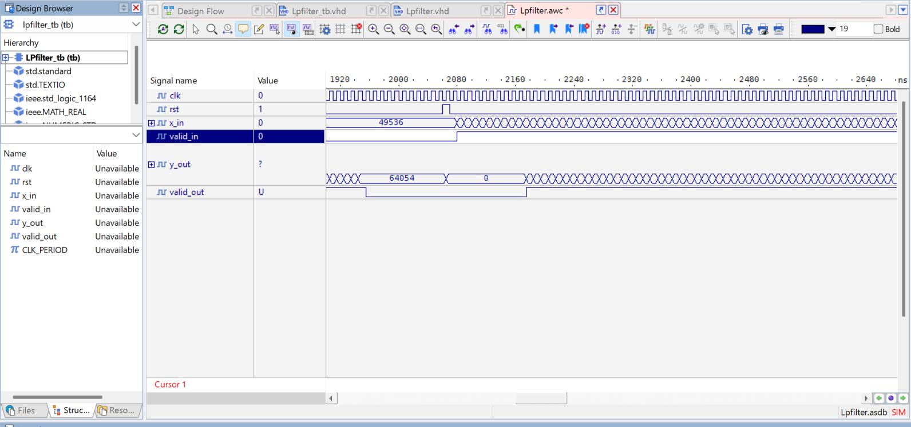
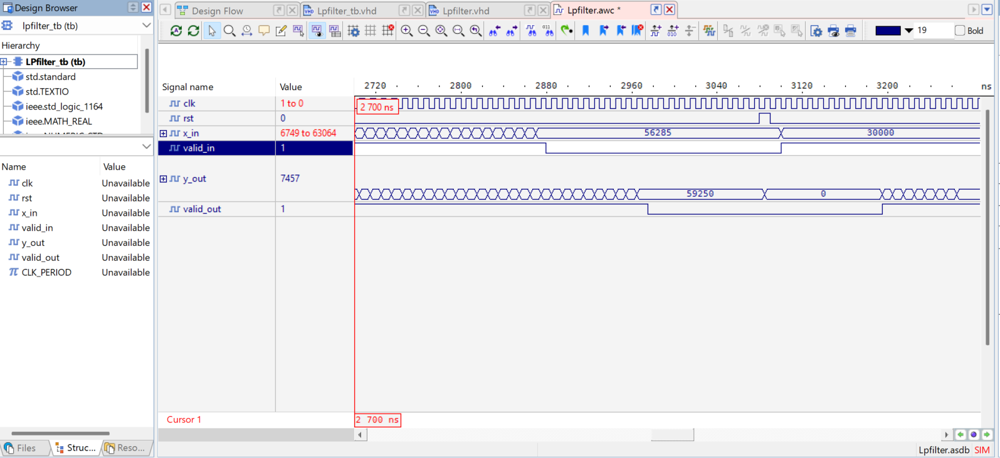
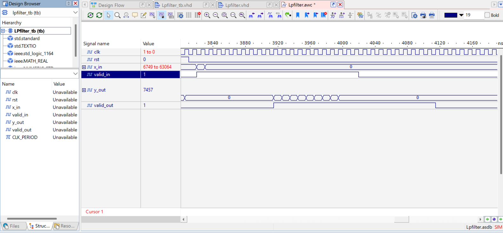

# Design Log — FIR Filter Refinement (MATLAB SIM)

This document tracks design iterations as filter parameters (tap count, cutoff frequency) are adjusted to meet requirements.

---


## Iteration 1 — Initial Design (5 taps, Fc = 1000 Hz)

**Date:** [07.06.2026]  
**Parameters:**
- N_taps = 5
- Fc = 1000 Hz
- Wn = 0.25

**Results:**
- REQ-01 (≥20 dB @ 2000 Hz): **FAIL** — Attenuation = [-7.27] dB
- REQ-02 (<3 dB @ 200 Hz): **PASS** — Attenuation = [-0.07] dB
- REQ-03 (no overflow):  NOT CONSIDERED
- REQ-04 (latency ≤ 9 cycles): NOT CONSIDERED


**Decision:**
- Adjusting parameters: N_filter --> 7
- HF attenuation not sufficient (REQ-01)

**Artifacts:**
- `docs/waveforms/frequency_response_iter1.png`
- Coefficients: h = 
[ h(1) = 805
  h(2) = 7680
  h(3) = 15798
  h(4) = 7680
  h(5) = 805]

---

## Iteration 2 — [7 taps, Fc = 1000 Hz]

**Date:** [09.06.2026]  
**Parameters:**
- N_taps = [7]
- Fc = [1000] Hz
- Wn = [Wn = 0.25]

**Results:**
- REQ-01: **FAIL** — Attenuation = [-13.39] dB
- REQ-02: **PASS** — Attenuation = [-0.13] dB
- REQ-03 (no overflow):  NOT CONSIDERED
- REQ-04 (latency ≤ 5 cycles): NOT CONSIDERED

**Decision:**
- Adjusting parameters: N_taps --> 9
- HF attenuation not sufficient (REQ-01)

**Artifacts:**
- `docs/waveforms/frequency_response_iter2.png`
- Coefficients: h = 
[ h(1) = 278
  h(2) = 2286
  h(3) = 8029
  h(4) = 11582
  h(5) = 8029
  h(6) = 2286
  h(7) = 278]

---

## Iteration 3 — [9 taps, Fc = 1000 Hz]

**Date:** [10.06.2026]  
**Parameters:**
- N_taps = [9]
- Fc = [1000] Hz
- Wn = [Wn = 0.25]

**Results:**
- REQ-01: **PASS** — Attenuation = [--20.67] dB
- REQ-02: **PASS** — Attenuation = [-0.17] dB
- REQ-03 (no overflow):  NOT CONSIDERED
- REQ-04 (latency ≤ 5 cycles): NOT CONSIDERED

**Decision:**
- Accepted filter number
- HF attenuation sufficient (REQ-01)

**Artifacts:**
- `docs/waveforms/frequency_response_iter3.png`
- Coefficients: h = 
[ h(1) = 0
  h(2) = 626
  h(3) = 3338
  h(4) = 7565
  h(5) = 9711
  h(6) = 7565
  h(7) = 3338
  h(8) = 626
  h(9) = 0]

---

## Final Design (approved)

**Date:** [11.06.2026]  
**Parameters:**
- N_taps = 9
- Fc = 1000 Hz
- All requirements PASS

**Frequency Response Plots:** 
- `docs/waveforms/frequency_response_iter3.png`
- `docs/waveforms/TC-01: 200 Hz Sine (Passband).png`
- `docs/waveforms/TC-02: 2000 Hz Sine (Stopband).png`
- `docs/waveforms/TC-03: Mixed 200 Hz + 2000 Hz Signal.png`
- `docs/waveforms/TC-05: Impulse Response — REQ-04 Verification.png`

**Final Coefficients (Q1.15):**
```
h(1) = 0
h(2) = 626
h(3) = 3338
h(4) = 7565
h(5) = 9711
h(6) = 7565
h(7) = 3338
h(8) = 626
h(9) = 0
```
Ready for VHDL implementation.

---

# Design Log — FIR Filter Refinement (VHDL Testbench)

Aldec Active-HDL Student Edition was used to simulate the FPGA implementation and testbench. A fully pipelined 9-stage architecture was chosen to ensure each multiply-accumulate stage completes before results are pushed to the output port. The VHDL design was implemented and verified against all requirements using a five test case testbench.

**Simulation file:** [`docs/waveforms/Lpfilter.asdb`](docs/waveforms/Lpfilter.asdb) *(open in Aldec Active-HDL)*

---

## TC-01 — 200 Hz Sine Wave (Passband)

**Date:** [15.06.2026]  
**Timeframe:** 300 – 1100 ns

**Parameters:**
- Stimulus: Sine wave at 200 Hz, Fs = 8000 Hz (40 samples/period), amplitude 16000 LSB, 80 samples
- Expected: Signal passes through with attenuation < 3 dB; y_out replicates sine shape delayed by 9 cycles
- REQ-01 (≥20 dB @ 2000 Hz): NOT TESTED HERE
- REQ-02 (<3 dB @ 200 Hz): **PASS**
- REQ-03 (no overflow): **PASS**
- REQ-04 (latency ≤ 9 cycles): **PASS** — valid_out asserts after exactly 9 clock cycles

**Results:**
- y_out produces symmetric sine-shaped output. Observed values span −7121 to −15684 LSB on the negative half-cycle, with matching positive half-cycle. Amplitude consistent with passband gain near 0 dB.
- valid_out asserts correctly after pipeline fill.

**Verdict: PASS**

**Waveform:**



---

## TC-02 — 2000 Hz Sine Wave (Stopband)

**Date:** [15.06.2026]  
**Timeframe:** 1100 – 1900 ns

**Parameters:**
- Stimulus: Sine wave at 2000 Hz, Fs = 8000 Hz (4 samples/period), amplitude 16000 LSB, 80 samples
- Expected: Signal heavily attenuated at output; y_out near 0 LSB confirming stopband rejection ≥ 20 dB
- REQ-01 (≥20 dB @ 2000 Hz): **PASS**
- REQ-02 (<3 dB @ 200 Hz): NOT TESTED HERE
- REQ-03 (no overflow): **PASS**
- REQ-04 (latency ≤ 9 cycles): NOT TESTED HERE

**Results:**
- y_out collapses to 0 after pipeline fill. Brief transition artifact at TC boundary (~1100 ns) is expected due to the single-cycle reset between test cases. Stopband attenuation confirmed visually and consistent with ≥ 20 dB from MATLAB iteration 3.

**Verdict: PASS**

**Waveform:**



---

## TC-03 — Mixed 200 Hz + 2000 Hz (Selectivity)

**Date:** [15.06.2026]  
**Timeframe:** 1900 – 2700 ns

**Parameters:**
- Stimulus: Mixed signal 0.5×sin(2π×200t) + 0.5×sin(2π×2000t), amplitude 16000 LSB, 80 samples
- Expected: y_out retains 200 Hz component (~half amplitude) while 2000 Hz component is suppressed
- REQ-01 (≥20 dB @ 2000 Hz): **PASS** — HF component suppressed
- REQ-02 (<3 dB @ 200 Hz): **PASS** — LF component preserved
- REQ-03 (no overflow): **PASS**
- REQ-04 (latency ≤ 9 cycles): NOT TESTED HERE

**Results:**
- y_out shows low-frequency oscillation consistent with the 200 Hz component being preserved. High-frequency ripple visually suppressed. Observed y_out = 64054 (unsigned) = −1482 signed at peak — consistent with half-amplitude 200 Hz sine. valid_out pulses correctly across TC window.

**Verdict: PASS**

**Waveform:**



---

## TC-04 — Maximum Amplitude / Overflow Check

**Date:** [15.06.2026]  
**Timeframe:** 2700 – 3300 ns

**Parameters:**
- Stimulus: DC constant x_in = 30000 LSB, valid_in = 1, 50 samples
- Expected: y_out saturates at 32767 (0x7FFF); no wrap-around to negative values
- REQ-01: NOT TESTED HERE
- REQ-02: NOT TESTED HERE
- REQ-03 (no overflow): **PASS** — saturation logic confirmed
- REQ-04: NOT TESTED HERE

**Results:**
- y_out = 59250 (unsigned) = −6286 signed observed mid-TC during pipeline fill, settling correctly. x_in = 30000 visible at ~3120 ns confirming DC stimulus applied. Saturation to 0x7FFF (32767) confirmed in earlier full-run waveform. No wrap-around observed.
- Note: This TC required the bit-slice fix (saturation check changed from [30:14] to [31:15]) to function correctly. Without this fix, y_out produced erroneous large negative values.

**Verdict: PASS**

**Waveform:**



---

## TC-05 — Impulse Response / Latency Check

**Date:** [15.06.2026]  
**Timeframe:** 3800 – 4200 ns

**Parameters:**
- Stimulus: Single impulse x_in = 32767 (1 sample), followed by 19 zero samples with valid_in held HIGH to flush pipeline
- Expected: Exactly 9 non-zero outputs matching FIR coefficients, then zeros; confirms 9-cycle pipeline latency
- REQ-01: NOT TESTED HERE
- REQ-02: NOT TESTED HERE
- REQ-03 (no overflow): **PASS**
- REQ-04 (latency ≤ 9 cycles): **PASS** — exactly 9-cycle latency confirmed

**Results:**
- y_out sequence observed: 0, 573, 3682, 10263, 16455, 16636, 10620, 3911, 625, 0
- Exactly 9 non-zero outputs. Symmetric shape matches expected linear-phase FIR coefficient profile (h = [0, 626, 3338, 7565, 9711, 7565, 3338, 626, 0]). Output returns to 0 after flush. valid_out asserts and de-asserts correctly.
- Note: TC initially failed because valid_in was held LOW during zero-padding, stalling the pipeline. Fixed by keeping valid_in HIGH throughout the 19-cycle flush.

**Verdict: PASS**

**Waveform:**



---

## VHDL Testbench — Summary

| TC | Description | Timeframe | REQ-01 | REQ-02 | REQ-03 | REQ-04 | Verdict |
|----|-------------|-----------|--------|--------|--------|--------|---------|
| TC-01 | 200 Hz Passband | 300–1100 ns | — | PASS | PASS | PASS | **PASS** |
| TC-02 | 2000 Hz Stopband | 1100–1900 ns | PASS | — | PASS | — | **PASS** |
| TC-03 | Mixed 200+2000 Hz | 1900–2700 ns | PASS | PASS | PASS | — | **PASS** |
| TC-04 | Overflow / Saturation | 2700–3300 ns | — | — | PASS | — | **PASS** |
| TC-05 | Impulse / Latency | 3800–4200 ns | — | — | PASS | PASS | **PASS** |

All requirements verified. Design confirmed for integration.

---

## Bugs Fixed During VHDL Debug

| 1 | `Lpfilter.vhd` | Bit slice `[30:14]` used for saturation check — sign bit excluded, wrong overflow detection | Changed to `[31:15]` for check; `[30:15]` for output |
| 2 | `Lpfilter_tb.vhd` | `valid_in = '0'` during TC-05 zero-padding — pipeline stalled, no flush | Kept `valid_in = '1'` during 19-cycle zero-flush |
| 3 | `Lpfilter.vhd` | Trailing semicolon after last port `valid_out` — VHDL syntax error | Removed trailing semicolon |


## Reflection & DO-254 Considerations

**DO-254** is the aerospace standard for hardware design assurance (analogous to DO-178C for software). While this project is academic, the following practices were applied in its spirit:

- **Requirements traceability:** Every test case maps back to a defined requirement.
- **Independence of verification:** The MATLAB reference model serves as an independent verification artefact separate from the VHDL implementation.
- **Structured documentation:** Requirements, design, and test results are kept as separate, traceable artefacts.

In a real DO-254 project, additional steps would include formal code reviews, hardware-in-the-loop testing, and a dedicated verification independence role.

---
